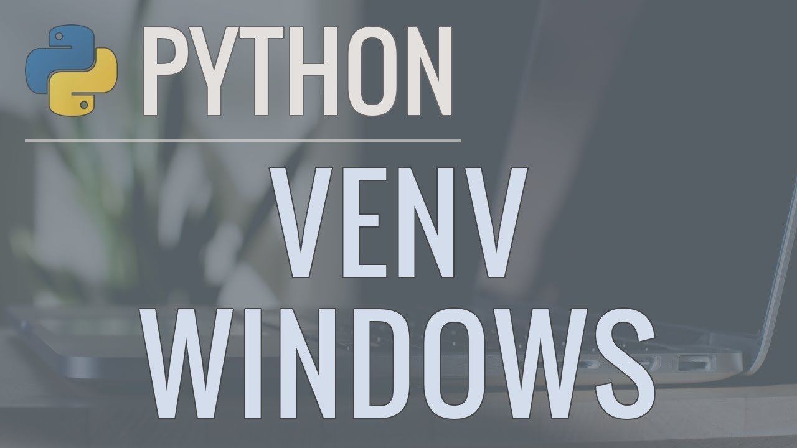
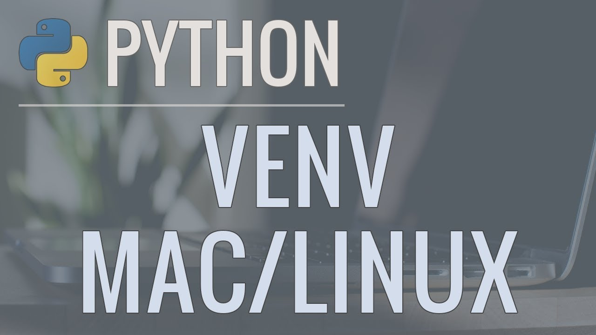
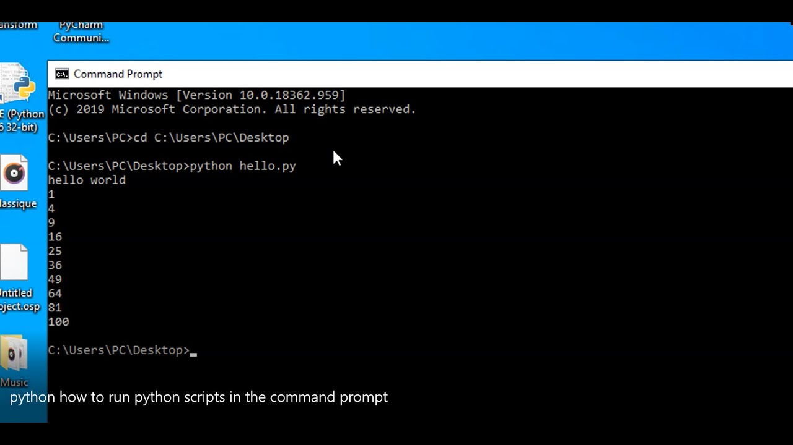

# Virtual Environments

Every operating system has a base Python version that is reponsible for running some things within the computer. 

Moreover, Python works by having a vey basic version, sometimes called *vanilla*, while most of the utilities have to be installed as *dependencies* or *packages*. These are normally the ones that have the sauce in them! 

Thus, in very **project** you will work on, you will have a set of depencencies that you will need and also, their **versions**. This means that two different projects might need the same package, but with different versions...

This raises an issue of incompatibility and therefore we introduce *Virtual Environments*. These are copies of vanilla Pythons and the specific set of dependencies we need for a project (normally these dependencies come in the form of a *requirements.txt* file as the one you will use to create). This way we can have isolated copies and use each of these copies independently. 

There are several tools that allows us to create these virtual environments: conda, poetry, pipenv, etc. In here, we will use venv given that it is easy to use and allows you to control where to install your virtual environments. 

## Windows (00:17)

[Link to video](https://www.youtube.com/watch?v=APOPm01BVrk)

## Linux & Mac (00:14)

[Link to video](https://www.youtube.com/watch?v=Kg1Yvry_Ydk)

# How to run Jupyter Notebooks and Python scripts

You will learn in the next section what Jupyter Notebooks and scripts are, but first, we need to teach you how to run them. 

## Jupyter Notebooks (00:07)

[Link to video](https://www.youtube.com/watch?v=jZ952vChhuI)

## Python script (00:05)

[Link to video](https://www.youtube.com/watch?v=Shf5m_Uol9g)