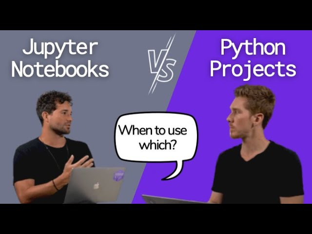
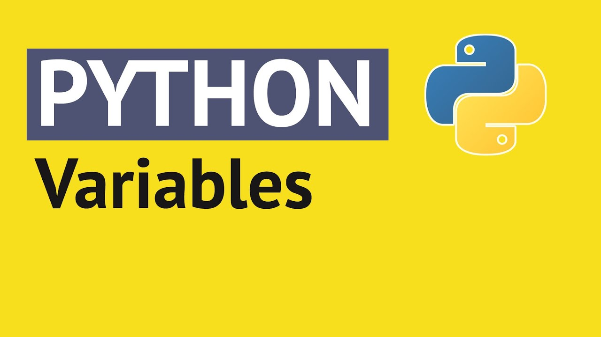

# General Python

The first question of every course should be *Why?*. Why do we want to learn Python? Why choosing Python among the vast majority of programming languages?

## The Whys (00:05)

[Link to video](https://www.youtube.com/watch?v=Y8Tko2YC5hA)

## Jupyter Notebooks vs Scripts (00:06)

One of the things most people tend to miss when teaching Python is to teach students how to **properly program**, mimicking the work of a data scientist or engineer. In the following video, there is an in-depth discussion of two programming experts on when to use each of the approaches and why they are different.

**Pay attention** that some of the things you will see in the video will be a bit advanced, but it is also good for you to start listening to these words and concepts!

[Link to video](https://www.youtube.com/watch?v=JGnoTN1OnWY)

## Variables and Basic Operators (00:06 + 00:11) 

A variable is a container for a value. We use variables to store values that we can later use by their names. Instead of memorizing all the values, we store the value once and perform all of the operations referencing their name afterwards.

[Link to video](https://www.youtube.com/watch?v=cQT33yu9pY8)

The operators allow you to perform operations on variables and values. There are multiple categories of operators, but we'll focus on the most useful ones.

[Link to video](https://www.youtube.com/watch?v=v5MR5JnKcZI)

## How to execute a Python Script from the command line (00:05)

In this [video](https://www.youtube.com/watch?v=Shf5m_Uol9g&t=119s), you will learn how to execute Python scripts (`.py` files) via the command line. This will be helpful for executing the task at the end of the section!

## How to use Notebooks inside VSCode (00:04)

In this [video](https://www.youtube.com/watch?v=h1sAzPojKMg), you'll learn how to use Notebooks inside VSCode. *Note: you can also use Jupyter Notebooks to view the `ipynb` files available in the course materials, though we are showing you a video with VSCode because we really want to incentivize the usage of IDEs* :-)

## Let's play!

Before leaving this section, it's important that you can execute your own Python code and be comfortable with Jupyter notebooks.
Head over to the `1-general_python.ipynb` and run the code you see in there. Also, try to run the `example.py` file from the command line! 

Also, take a shot at the quiz we've prepared for you [here](https://forms.gle/L13J3jQk16gmypw16)

After being able to do both of these tasks, you're good to go!
