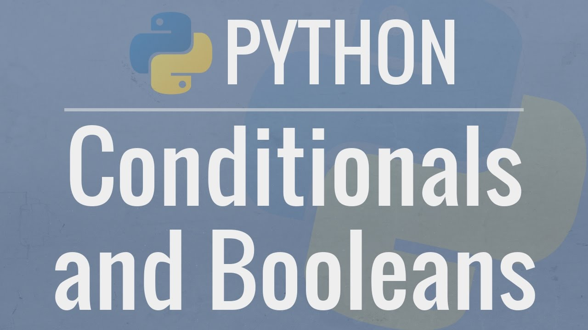
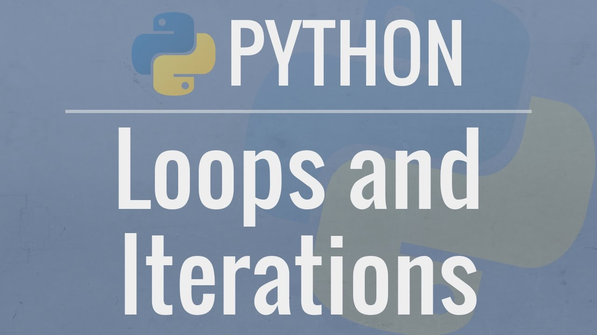
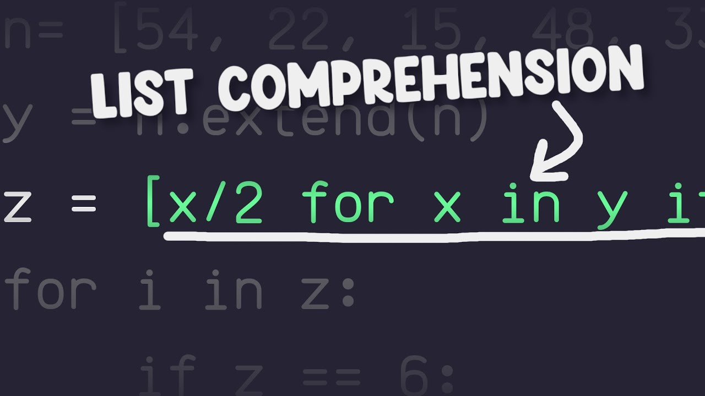
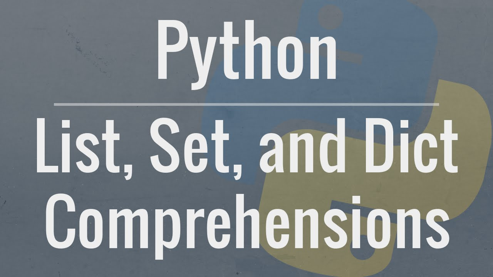

# Iteration & Flow

Welcome to the "Iteration & Flow" unit of the Python Academy! In this notebook, you will learn:
- Flow Control
- Indentation
- `if-elif-else` statements
-  Loops: `while` and `for`
-  `continue` and `break`
-  List Comprehension

Building a program is essentially defining actions to perform depending on certain conditions. This can be setting up an alarm to trigger at midnight (time >> alarm), a weather forecast app (metereological conditions >> forecast) or discovering business insights from the latest financial reports (financial values >> analysis). **Flow Control is what allows you to check for conditions, act accordingly and iterate on repeatable code.**

## If/elif/else statements and conditionals

In Python, the main concepts for flow control comprise:
   - `if` a condition do something, or something  `else`

[Link to video](https://www.youtube.com/watch?v=DZwmZ8Usvnk)

## For/While loops and break/continue

   - `while` a certain condition is true, continue iterating until it no longer applies
   - `for` a specific number of times, repeat the same action
   - manually controlling to `continue` to the next iteration of a loop, or else `break` the loop immediately.

[Link to video](https://www.youtube.com/watch?v=6iF8Xb7Z3wQ)

## Bonus: List/dict/set comprehension

List/dict/set comprehension is one of the things you want to be comfortable with if you want to write decent Python code. In here we present a short introductory video 

[Link to video](https://www.youtube.com/watch?v=l8mWvDUwOt4)

and a more in-depth explannation

[Link to video](https://www.youtube.com/watch?v=3dt4OGnU5sM)