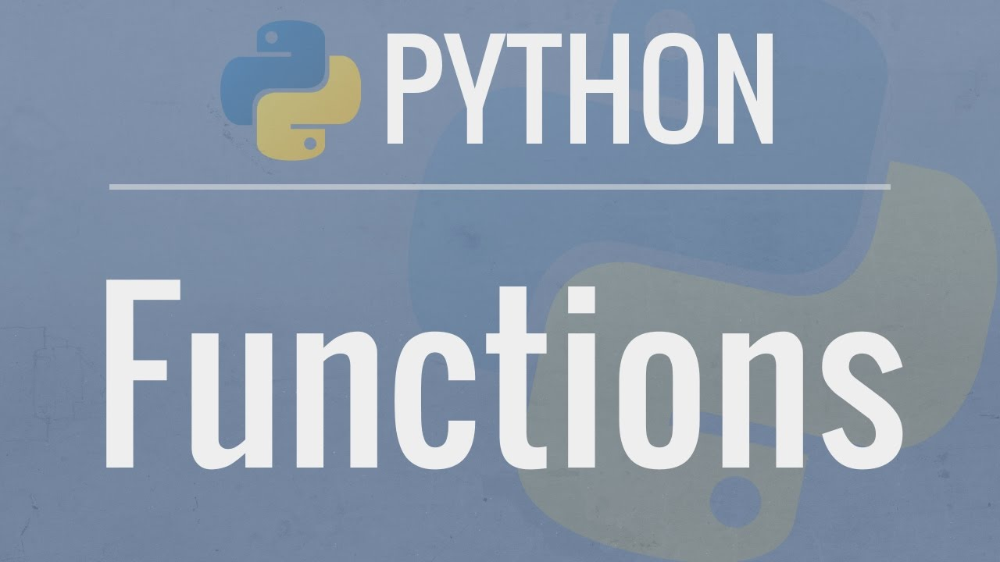
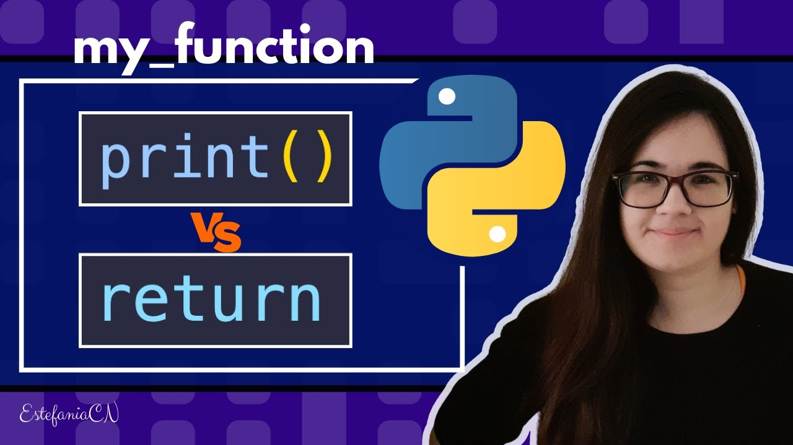

# Functions

Functions are one of the most powerful concepts in programming. They allow us to **avoid repeatable code by clearly defining how we process inputs into outputs.**

Creating a **function** is establishing the machinery that transforms inputs into outputs. Similar to real life, establishing such machineries enabling the conversion between different stuff. A coffee grinder takes coffee beans and outputs ground coffee. A car engine drinks fuel (plus oil and spare parts) to generate mechanical energy to drive the wheels. A programmer takes coffee and outputs some weird code.

[Link to video](https://www.youtube.com/watch?v=9Os0o3wzS_I)

## `print` vs `return`

[Link to video](https://www.youtube.com/watch?v=LWdsF79H1Pg)