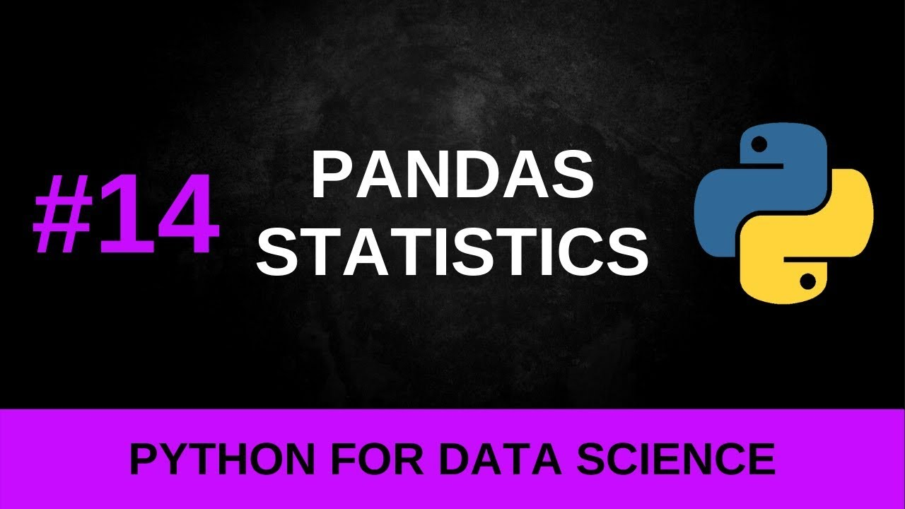
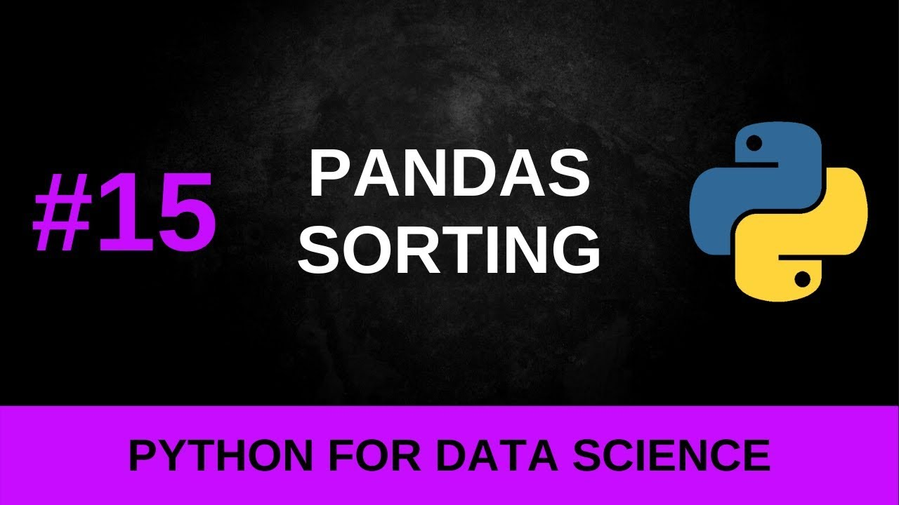

# DataFrames intermediate

## Pandas Statistics

[Link to video](https://www.youtube.com/watch?v=5JZbNphkk1Y)

## Pandas sorting and functions

[Link to video](https://www.youtube.com/watch?v=KprynXFI1gE)

## Pandas Data Cleaning

[Link to video](https://www.youtube.com/watch?v=bDhvCp3_lYw)

## Group By and Aggregate

[Link to video](https://www.youtube.com/watch?v=VRmXto2YA2I)